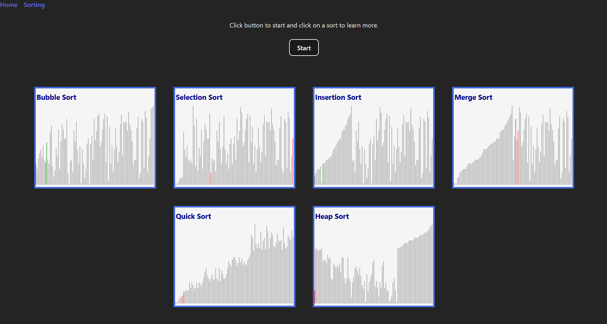

# Algorithm Visualizer
I built this application to strengthen my own knowledge of algorithms and data structures
in addition to helping others learn about them. There is a "time accurate" (see below) comparison of
Bubble, Insertion, Selection, Merge, Quick, and Heap sort. Each sort can be clicked on to view with
a description and in a slower and smaller visualization.
  
Link to the project: https://carlgross.github.io/Algorithm-Visualizer/

# Tech Stack
Front end: HTML/CSS/JavaScript/React     
Deployment: GitHub Pages

# Technical Details/Problems
The CanvasVisualizer React component is built using HTML Canvas and takes in a few parameters such as
steps, speed interval, and size. The steps are gathered from functions in custom made js sort files. One
problem is that everytime it runs, it bases the speed of the different algorithms off of their actual performance.
It's possible that this is innacurate if the program slows down or speeds up unexpectedly.  

# Lessons Learned
Through this project, I:  
- Learned the basics of React and improved my skills of HTML/CSS/JavaScript.
- Furthered my understanding of data structures and algorithms.
- Used GitHub pages to host a static page for the first time.

